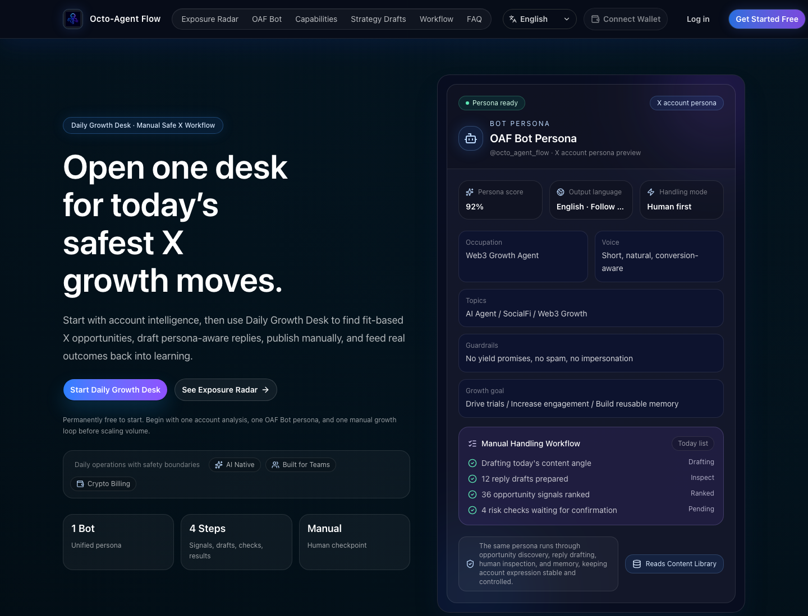
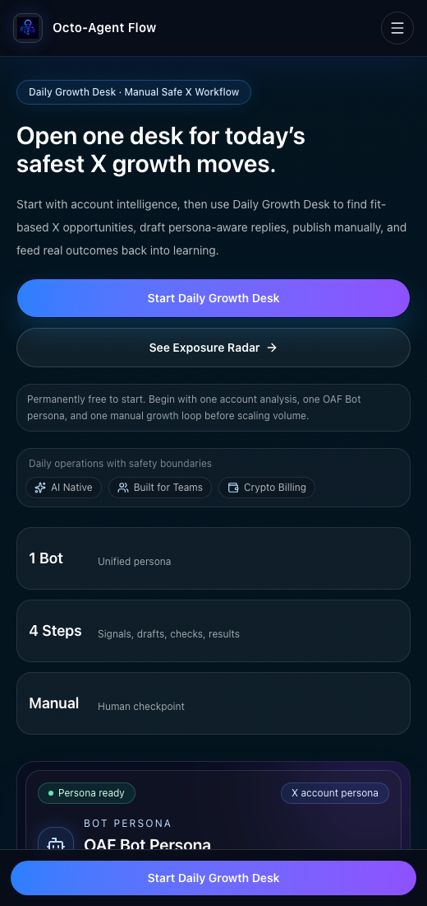

<p align="center">
  <strong>English</strong>
  ·
  <a href="README.zh-CN.md">简体中文</a>
</p>

<p align="center">
  <a href="https://octoagentflow.github.io/octo-agent/">
    
  </a>
</p>

<h1 align="center">OctoAgentFlow</h1>

<p align="center">
  <strong>AI social operations workflow for X accounts.</strong>
</p>

<p align="center">
  <a href="https://octoagentflow.github.io/octo-agent/">Official Website</a>
  ·
  <a href="docs/README.md">Docs</a>
  ·
  <a href="CONTRIBUTING.md">Contributing</a>
  ·
  <a href="SECURITY.md">Security</a>
  ·
  <a href="SUPPORT.md">Support</a>
</p>

<p align="center">
  <a href="https://github.com/OctoAgentFlow/octo-agent/releases">
    
  </a>
  <a href="LICENSE">
    
  </a>
  <a href="https://github.com/OctoAgentFlow/octo-agent/actions/workflows/validate.yml">
    
  </a>
</p>

## Official Website

The public homepage is deployed with GitHub Pages:

[https://octoagentflow.github.io/octo-agent/](https://octoagentflow.github.io/octo-agent/)

<a href="https://octoagentflow.github.io/octo-agent/">
  
</a>

<p align="center">
  
</p>

## What It Is

OctoAgentFlow helps operators run controlled X account workflows with OAF Bots,
content memory, guardrails, review queues, execution queues, publishing
workflows, and human-in-the-loop feedback.

It is not positioned as a fully automated engagement bot. The current product
direction is safe manual operation with AI assistance.

## Core Surfaces

- Daily Growth Desk: a daily operating surface for X growth work.
- Exposure Radar: Chinese and English opportunity signals, hot/rising
  classification, diagnostics, reply angle suggestions, and manual handling
  records.
- OAF Bots: persona, voice, topics, boundaries, and learning preferences for
  each X account.
- Content Memory: reusable product points, signal context, reply learnings, and
  source traces.
- Content Drafts: copy-ready post or reply suggestions built from persona,
  memory, and opportunity context.
- Handling List: review, edit, copy, open original post, record handling
  outcome, and track follow-through.
- Account Intelligence: public-account positioning analysis and improvement
  suggestions based on data the system can legally access.

## Tech Stack

- Frontend: Next.js App Router, React, Tailwind CSS, shadcn-style components,
  React Hook Form, and Zod.
- Backend: Gin, GORM, and MySQL.
- Tooling: Make targets plus smoke and compatibility checks under `scripts/`.
- Website deployment: GitHub Pages through `.github/workflows/deploy-website.yml`.

## Local Development

Prerequisites:

- Node.js 22+
- npm 10+
- Go 1.25+
- MySQL 8+

Install dependencies:

```bash
make install
```

Configure local environment files:

```bash
cp backend/configs/.env.example backend/configs/.env
cp frontend/.env.example frontend/.env.local
```

Start services in separate terminals:

```bash
make api-local
make admin-local
make api-front-local
make admin-front-local
```

Default local URLs:

- API Front: `http://localhost:3000`
- Admin Front: `http://localhost:3001`
- API service: `http://localhost:10001`
- Admin API service: `http://localhost:10002`

## Useful Commands

```bash
make lint
scripts/smoke-core-workflows.sh
scripts/check-legacy-compat-contracts.sh
cd frontend && npm run build:github-pages
```

## Repository Structure

- `frontend/`: Next.js application and GitHub Pages website export script.
- `backend/`: Gin API and Admin API services.
- `scripts/`: local development, smoke, and compatibility helpers.
- `docs/`: public API, database, and website reference documents.

Private deployment runbooks, launch notes, growth plans, and acceptance reports
are intentionally not included in this public repository.

## Security

Do not commit `.env` files, API keys, OAuth secrets, database credentials,
wallet private keys, production payment addresses, logs, or private runbooks.

See [SECURITY.md](SECURITY.md) for reporting guidance.

## Contributing

Contributions are welcome when they improve the core social operations
workflow, developer experience, documentation quality, or security posture.

Start with [CONTRIBUTING.md](CONTRIBUTING.md), and please follow the
[Code of Conduct](CODE_OF_CONDUCT.md).

## Support

Use GitHub Issues for reproducible bugs, documentation fixes, and focused
feature proposals. Please use [GitHub Security Advisories](SECURITY.md) for
vulnerability reports.

## License

OctoAgentFlow is released under the [MIT License](LICENSE).
