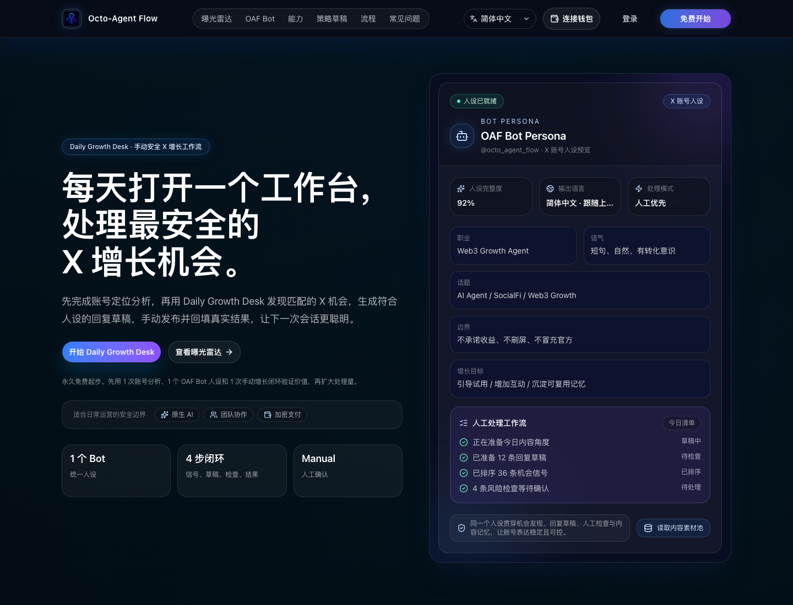

# 文档

  <a href="README.md">English</a>
  ·
  <strong>简体中文</strong>

本公开文档集只保留对贡献者和自托管开发实例运营者有帮助的参考资料。

官方首页：[https://octoagentflow.github.io/octo-agent/](https://octoagentflow.github.io/octo-agent/)

## 官网截图

  

## API

- `api/README.md`：API 文档入口。
- `api/*.md`：按路由整理的 API 说明。

## 数据库

- `database/tables.md`：数据库表概览。
- `database/er-diagram.md`：实体关系图。

内部发布说明、部署 runbook、增长计划、验收报告和私有产品规划文档不属于公开仓库内容。
