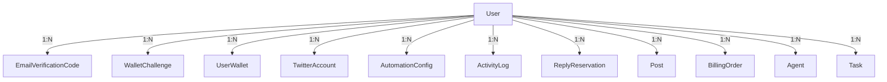

# ER Diagram

## 当前已落地关系（代码中已实现）

以下反映 `AutoMigrate` 中的模型及其典型归属关系（逻辑上 `User` 为多端数据所有者）：

> `Post` 已有完整 CRUD、手动执行与调度发推链路；`BillingOrder` 配合 `BillingChainTx` 做链上确认；`Agent` / `Task` 与对外 `GET /agents` 仍在演进中。

## 规划中目标关系（后续迭代）

若引入独立订阅快照表、支付流水明细表等，可在未来 `migrate.go` 中扩展；**以届时 model 为准**。
