# ER Diagram

以下为当前代码中已落地的主要逻辑关系。物理外键并非所有表都强制声明，实际约束以 `backend/internal/model` 与 repository/service 校验为准。

## 核心关系

```mermaid
flowchart TD
  User["users"] --> EmailCode["email_verification_codes"]
  User --> WalletChallenge["wallet_challenges"]
  User --> UserWallet["user_wallets"]
  User --> TwitterAccount["twitter_accounts"]
  User --> Notification["user_notification_settings"]

  User --> OAFBot["oaf_bots"]
  TwitterAccount --> OAFBot
  OAFBot --> AIUsage["ai_generation_usages"]
  User --> AIUsage

  User --> AutomationConfig["automation_configs"]

  User --> AutoPostPlan["auto_post_plans"]
  TwitterAccount --> AutoPostPlan
  AutoPostPlan --> AutoPostDraft["auto_post_drafts"]
  AutoPostPlan --> AutoPostRun["auto_post_generation_runs"]
  User --> ContentItem["content_library_items"]
  TwitterAccount --> ContentItem
  OAFBot --> ContentItem
  ContentItem --> AutoPostDraft
  OAFBot --> AutoPostDraft

  User --> AutoReplyDraft["auto_reply_drafts"]
  TwitterAccount --> AutoReplyDraft
  OAFBot --> AutoReplyDraft

  User --> AutoCommentTarget["auto_comment_targets"]
  TwitterAccount --> AutoCommentTarget
  AutoCommentTarget --> AutoCommentTask["auto_comment_tasks"]
  OAFBot --> AutoCommentTask

  User --> AutoDMTask["auto_dm_tasks"]
  User --> AutoDMRule["auto_dm_recipient_rules"]
  User --> AutoDMImport["auto_dm_recipient_imports"]
  TwitterAccount --> AutoDMTask
  TwitterAccount --> AutoDMRule
  AutoDMImport --> AutoDMRule

  AutoPostDraft --> PublishJob["publish_jobs"]
  AutoReplyDraft --> PublishJob
  AutoCommentTask --> PublishJob
  TwitterAccount --> PublishJob

  User --> Activity["activity_logs"]
  TwitterAccount --> Activity

  User --> Post["posts"]
  TwitterAccount --> Post

  User --> BillingOrder["billing_orders"]
  BillingOrder --> BillingAudit["billing_order_audits"]
  BillingOrder --> BillingTx["billing_chain_txs"]

  User --> Agent["agents"]
  User --> Task["tasks"]
```

## 关系说明

- `twitter_accounts` 是 OAF Bot 和自动化执行的账号入口。
- `oaf_bots.twitter_account_id` 当前是单值绑定：一个 Bot 最多绑定一个 X 账号，一个 X 账号同一时间最多绑定一个 active Bot。
- Auto Post / Auto Reply / Auto Comment 生成时按 `twitter_account_id` 查询绑定 OAF Bot。
- AI 生成成功后写入 `ai_generation_usages`，按 `user_id + bot_id + scene + month` 聚合。
- Auto Post 的“说什么”来自 `content_library_items`，生成节奏来自 `auto_post_plans`，生成结果写入 `auto_post_drafts`。
- Auto Reply / Auto Comment 生成结果分别写入 `auto_reply_drafts` / `auto_comment_tasks`。
- Execution Queue 查询聚合 post/comment/reply 相关草稿或任务。
- Publishing Pipeline 使用 `publish_jobs` 统一处理 post/comment/reply 的待发布内容。
- scheduler 只 simulated publish；真实 X 发布必须通过手动 `publish-now`，并受 `x_publisher` 配置控制。
- `posts` 保留传统帖子 CRUD、手动发布和定时发布能力；新版 Auto Post 工作台优先使用 `auto_post_*` 表。
- `agents` / `tasks` 是历史 scaffold/兼容实体，不是当前 OAF Bot 主模型。
