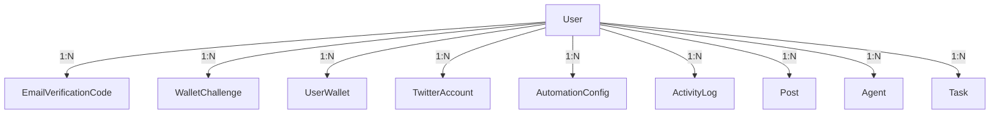
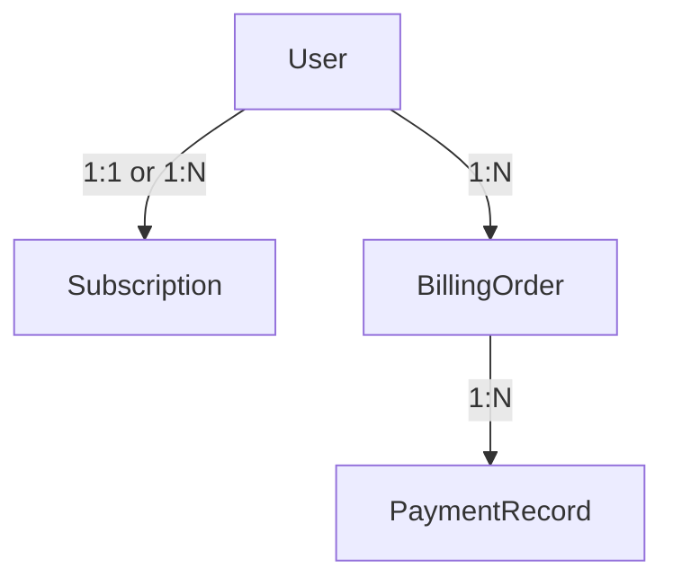

# ER Diagram

## 当前已落地关系（代码中已实现）

以下反映 `AutoMigrate` 中的模型及其典型归属关系（逻辑上 `User` 为多端数据所有者）：

> `Post` / `Agent` / `Task` 表已迁移，但与对外 API 的完整读写链路仍在演进中。

## 规划中目标关系（后续迭代）

计费、订单等若单独建表，可扩展为类似：

（以未来 `migrate.go` 为准。）
