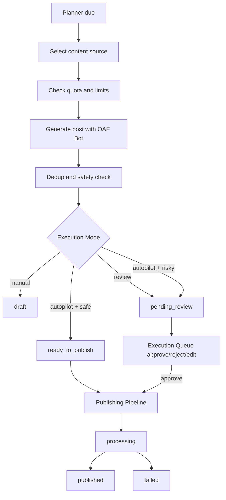

# Auto Post 在 OAF Bot 体系下的产品重设计

## 1. 产品定位

Auto Post 不应该只是“用户手动创建一条固定帖子，然后等待定时发布”。在 OAF Bot 体系下，Auto Post 应该成为一个由机器人持续运营的内容发布工作流：

- OAF Bot 决定“怎么说”：人设、语言、语气、边界、增长目标。
- 内容来源决定“说什么”：内容池、主题、素材、产品更新、外部链接、用户手动草稿。
- 发推规则决定“什么时候说”：频率、时间窗、每日上限、内容类型轮换。
- Execution Mode 决定“是否人工审核”：manual、review、autopilot。
- Publishing Pipeline 负责“如何发布”：统一创建发布任务、限流、模拟发布、真实发布、失败重试。

因此，Auto Post 的产品形态应从“创建一条帖子”升级为“为某个 X 账号配置一套可持续生成与发布的内容系统”。

## 2. 核心问题结论

### Auto Post 是否需要人工审核？

需要支持可配置，而不是固定一种模式。

| Execution Mode | 适合场景 | Auto Post 行为 |
| --- | --- | --- |
| manual | 用户只想要灵感或草稿 | 只生成建议，不进入发布链路 |
| review | 默认推荐，适合大多数用户 | 生成后进入 Execution Queue，用户批准后发布 |
| autopilot | 高信任、低风险账号 | 生成后风控通过则进入 ready_to_publish，风险命中则降级到 pending_review |

MVP 阶段建议默认使用 review。autopilot 可以先生成 `ready_to_publish`，但测试环境仍通过 Publishing Pipeline 的 simulated publish 或人工真实发布灰度，不直接大规模真实发推。

### 当前 `/posts/create` 页面在 Auto Post 中扮演什么角色？

`/posts/create` 是内容池入口之一，不是完整 Auto Post 配置页面。

它应该用于：

- 手动写一条草稿。
- 创建一条待发布内容。
- 创建一条带计划时间的内容。
- 为 Auto Post 提供人工种子素材。
- 在 `source=auto_post` 时说明：这是 Auto Post 的内容来源，Auto Post 会读取 Posts 队列或内容池中符合规则的内容。

未来 Auto Post 不应要求用户每次都手动创建一条帖子。手动创建只是内容来源之一。

### OAF Bot 通过什么知道要发什么？

OAF Bot 不应该凭空发推。它需要读取内容来源：

1. Content Library：主题、素材、产品更新、链接、活动、FAQ、案例、观点。
2. Topic Strategy：用户配置的重点话题、禁聊话题、关键词、内容比例。
3. OAF Bot Persona：人设、语气、语言策略、增长目标。
4. Campaign Context：当前阶段目标，例如引导试用、增加互动、宣布功能、教育市场。
5. Existing Posts Memory：近期已发内容和已生成草稿，用于避免重复。

### OAF Bot 通过什么知道什么时候发？

通过 Auto Post Planner。

Planner 负责：

- 每日发推上限。
- 每周发布日。
- 时间窗。
- 内容类型轮换。
- 是否允许周末发布。
- 是否需要人工审核。
- 是否开启 autopilot。
- 根据账户和套餐额度决定是否生成。

### 如何避免每次生成的推文内容重复？

需要同时做内容策略和技术去重：

- 主题轮换：不要连续多次选择同一主题。
- 内容类型轮换：观点、教程、案例、产品更新、互动问题、转化 CTA 交替出现。
- 最近记忆：读取近 7-30 天已发布和已生成内容。
- 指纹去重：对生成文本做 normalized hash。
- 语义相似度，后续可引入 embedding。
- 冷却规则：同一个 content source 在一定时间内不重复使用。
- Prompt 中明确要求避开近期内容表达。

MVP 先做 normalized text hash + 最近内容摘要注入 Prompt。Embedding 去重放后续。

## 3. 用户流程

### 新用户最短流程

1. 绑定 X 账号。
2. 创建 OAF Bot。
3. 创建或导入内容来源。
4. 配置 Auto Post Planner。
5. 选择 Execution Mode。
6. 系统生成推文草稿。
7. 根据模式进入草稿、审核队列或待发布。
8. Publishing Pipeline 统一处理发布。

### 人工审核模式流程

1. 用户配置 OAF Bot 和 Planner。
2. 到达计划时间。
3. 系统从 Content Library 中选择一个合适素材。
4. OAF Bot 根据素材和人设生成推文。
5. AI 生成额度扣减 1 次。
6. 推文进入 Execution Queue，状态为 `pending_review`。
7. 用户编辑、批准或拒绝。
8. 批准后创建 publish job。
9. Publishing Pipeline simulated publish 或人工真实发布。

### 全托管模式流程

1. 用户配置 Planner 的 execution_mode 为 `autopilot`。
2. 到达计划时间。
3. 系统生成推文。
4. 风控检查通过则进入 `ready_to_publish`。
5. 风险命中则降级为 `pending_review`。
6. Publishing Pipeline 处理发布任务。

当前测试环境仍不建议自动真实发 X。真实发布应继续遵循 Publishing Pipeline V2 的灰度开关。

## 4. 页面结构

### `/automations`

定位：自动化总览。

保留：

- 上线前检查。
- 自动发推、自动回复、自动评论、自动私信入口。
- 当前自动化运行状态。
- 运行健康度。
- 跳转 Execution Queue。

不承载具体 Auto Post 配置。

### `/posts/create?source=auto_post`

定位：手动创建 Auto Post 内容来源。

用于：

- 创建待发布内容。
- 创建定时内容。
- 为 Content Library 添加一条人工草稿。
- 调用 AI 生成一条内容草稿。

页面需要明确提示：这是 Auto Post 的内容来源，不是完整自动发推规则配置。

### 新增 `/automations/posts` 或 `/auto-post`

定位：Auto Post 工作台。

建议包含以下 Tab：

1. Overview：当前账号、Bot、Planner、最近生成和发布状态。
2. Content Library：内容池。
3. Planner：发推规则。
4. Drafts：生成草稿。
5. History：发布历史和失败记录。

MVP 可先不新增完整页面，只在 `/automations` 保持入口，并继续跳转 `/posts/create?source=auto_post`。但产品目标应明确向 Auto Post 工作台演进。

## 5. 内容池 Content Library 设计

Content Library 是 Auto Post 的“说什么”来源。

### 内容池对象

每条内容来源可以是：

- 手动草稿。
- 产品更新。
- 功能介绍。
- FAQ。
- 案例。
- 活动公告。
- 观点主题。
- 链接素材。
- 长文摘要。
- 用户自定义 prompt seed。

### 建议字段

- 标题。
- 类型：idea、draft、link、product_update、faq、case_study、announcement、thread_seed。
- 内容正文或素材摘要。
- 关联话题。
- 目标：awareness、engagement、trial、dm_lead、education。
- CTA 偏好。
- 适用 Bot 或 X 账号。
- 状态：active、paused、archived、used。
- 优先级。
- 最近使用时间。
- 使用次数。

### 内容池和 Posts 的关系

Posts 是更接近“将要发布或已经发布的具体内容”的队列。

Content Library 是更上游的素材库：

- Content Library 里的一条素材可以生成多条不同 Posts。
- Posts 里的 scheduled 内容可以由用户手写，也可以由 OAF Bot 生成。
- `/posts/create` 可以先继续写入 Posts，后续再增加“保存到内容池”的能力。

MVP 阶段可以先复用 Posts 表作为临时内容池，但长期建议拆出 Content Library。

## 6. Auto Post Planner 设计

Planner 是 Auto Post 的“什么时候说”和“怎么轮换”的规则中心。

### Planner 配置

- X 账号。
- OAF Bot。
- 是否启用。
- Execution Mode：manual、review、autopilot。
- 每日发推上限。
- 每周发布日。
- 发布时间窗。
- 最小发布间隔。
- 内容类型比例。
- 话题轮换策略。
- 是否允许重复 CTA。
- 是否允许从空内容池生成通用内容。
- 风控模式。

### 内容类型比例示例

- 观点：30%
- 教育内容：25%
- 产品更新：20%
- 互动问题：15%
- 转化 CTA：10%

这样可以避免 OAF Bot 每次生成相似的营销推文。

## 7. 生成策略

生成时需要组合以下上下文：

1. OAF Bot 人设：身份、语气、语言、话题、禁聊、增长目标。
2. Planner 规则：目标内容类型、发布时间、执行模式。
3. Content Library 素材：本次选择的内容源。
4. 最近记忆：近期生成和发布过的推文。
5. Billing 限制：AI 生成额度和每日自动发推额度。

Prompt 目标：

- 只生成一条推文。
- 遵守语言策略。
- 不重复近期内容。
- 不承诺收益。
- 不冒充官方。
- 不刷屏。
- 不强行提及 Bot 名称。
- 根据内容类型控制风格。

## 8. 去重策略

### MVP 去重

- 保存生成文本 normalized hash。
- 查询近 30 天同账号 hash。
- 如果命中重复，重新生成一次，最多重试 2 次。
- Prompt 注入最近 5-10 条已发布或已生成内容摘要。
- 同一 content source 增加冷却时间。

### 后续增强

- embedding 相似度去重。
- 按主题聚类。
- 按 CTA 频率限制。
- 检测重复开头、重复句式和重复 hashtag。
- 支持用户标记“不再生成类似内容”。

## 9. 状态机

Auto Post 内容建议使用统一状态语义，最终和 Execution Queue / Publishing Pipeline 对齐。

## 10. 与其他模块的关系

### 与 OAF Bot

OAF Bot 仍然保持当前 one bot per account 模型：

- 一个 OAF Bot 最多绑定一个 X 账号。
- 一个 X 账号同一时间最多绑定一个 active OAF Bot。
- Auto Post 按 `twitter_account_id` 查找绑定的 OAF Bot。

OAF Bot 决定表达方式，不决定全部内容来源。

### 与 Posts

Posts 是具体内容队列：

- 用户手动创建的草稿或计划内容进入 Posts。
- OAF Bot 生成出的 Auto Post 草稿也可以进入 Posts 或统一 Execution Queue。
- 已发布内容可回写 Posts 状态。

短期可以继续让 `/posts/create?source=auto_post` 创建 Auto Post 内容。长期应把 Content Library 和 Posts 分层。

### 与 Execution Queue

Execution Queue 统一处理：

- manual 生成的草稿。
- review 模式待审核。
- autopilot 风控拦截内容。
- ready_to_publish 内容。
- failed 内容。

Auto Post 不应该自己做独立审核中心。

### 与 Publishing Pipeline

Publishing Pipeline 是唯一发布出口。

Auto Post 不直接调用 X API。它只创建可发布内容或 publish job，真实发布由 Publishing Pipeline 控制。

### 与 Billing

Auto Post 生成内容需要扣减：

- 套餐级 `monthly_ai_generations`。
- 每日 `daily_auto_posts`。

注意：当前 AI 生成额度是套餐级共享总额度，不是 scene 独立额度。

## 11. MVP 分阶段路线

### MVP 0：当前状态整理

- `/automations` 跳转 `/posts/create?source=auto_post`。
- `/posts/create` 明确显示 Auto Post 上下文。
- Auto Post AI 生成读取 OAF Bot。
- AI 生成额度扣减。

### MVP 1：Auto Post Planner 最小闭环

目标：让用户不用每次手动创建内容，也能让 OAF Bot 根据规则生成草稿。

范围：

- 新增 Auto Post Planner 配置。
- 选择 X 账号和 OAF Bot。
- 配置每日上限、时间窗、execution_mode。
- 支持“立即生成一条 Auto Post 草稿”。
- 生成结果进入 Execution Queue。
- AI 生成用量正常扣减。
- 不自动真实发布。

### MVP 2：Content Library 最小版

目标：让 OAF Bot 有明确内容来源。

范围：

- 新增内容池页面。
- 支持手动添加 idea / product_update / link / faq。
- Planner 生成时选择内容池素材。
- 素材使用次数和最近使用时间。
- 基础去重。

### MVP 3：计划任务生成

目标：让 Auto Post 到点生成内容。

范围：

- Scheduler 根据 Planner 到期时间生成草稿。
- review 模式进入 Execution Queue。
- autopilot 模式进入 ready_to_publish。
- Publishing Pipeline simulated publish。

### MVP 4：高级策略

范围：

- 内容类型比例。
- 主题轮换。
- embedding 去重。
- 内容表现反馈。
- 根据 Analytics 优化 Planner。
- 多 Bot 矩阵运营。

## 12. 本阶段不做

- 不直接开启大规模真实自动发推。
- 不让 Auto Post 绕过 Publishing Pipeline。
- 不把 `/posts/create` 改成复杂 Planner 页面。
- 不新增 scene 级 AI 生成额度。
- 不实现一个 Bot 绑定多个 X 账号。
- 不做复杂外部内容抓取和 RSS 导入。
