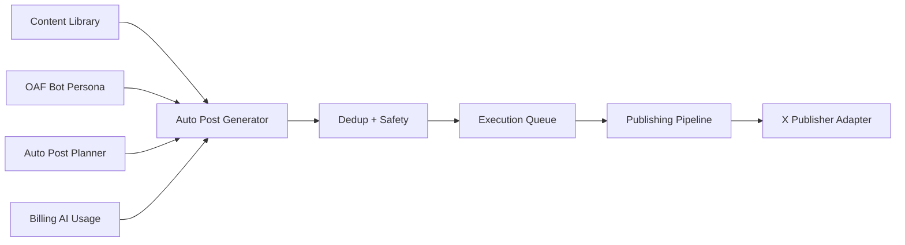

# Auto Post + OAF Bot 技术设计方案

> Historical archive note, updated 2026-06-17:
> This document describes an older automation-heavy design. The current product direction is the manual, review-first Daily Growth Desk / Exposure Radar workflow. See `docs/product/archive/legacy-automation-docs.md` and `docs/technical/content-draft-route-migration.md` before reusing implementation details.

## 1. 设计目标

本设计用于把 Auto Post 从“手动创建一条帖子并定时发布”升级为“基于 OAF Bot、人设、内容来源、发推规则、审核模式和统一发布器的自动发推工作流”。

核心目标：

- OAF Bot 只负责表达风格和人设，不单独决定全部内容。
- Content Library 提供内容来源。
- Auto Post Planner 负责生成节奏和规则。
- Execution Mode 决定生成内容的目标状态。
- Execution Queue 统一承接审核、待发布、失败处理。
- Publishing Pipeline 统一处理发布任务。
- Billing 继续使用套餐级 AI 生成总额度。

## 2. 当前系统可复用能力

当前项目已有能力：

- OAF Bot：one bot per account，按 `twitter_account_id` 查询。
- Posts：创建草稿、计划内容、状态管理。
- Auto Post AI Generate：根据 X 账号绑定的 OAF Bot 生成内容。
- AI Usage：记录 `scene=auto_post`。
- Execution Mode：manual、review、autopilot。
- Execution Queue：已聚合 post / comment / reply。
- Publishing Pipeline：统一 `publish_jobs`，支持 `source_type=post`、simulated publish 和人工真实发布灰度。

## 3. 总体架构



## 4. 页面与前端结构建议

### `/automations`

继续作为总览页，只提供入口和状态，不承载具体配置。

### `/posts/create?source=auto_post`

继续作为手动创建 Auto Post 内容来源的入口。

前端行为：

- `source=auto_post` 时展示 Auto Post 上下文。
- 保存逻辑仍使用现有 Posts API。
- 不修改 Posts 后端逻辑。

### `/auto-post` 或 `/automations/posts`

建议新增 Auto Post 工作台。

页面模块：

- Planner Summary。
- OAF Bot 状态。
- Content Library 入口。
- 立即生成草稿。
- 最近草稿。
- 最近发布。
- 跳转 Execution Queue。

当前已落地 Planner、Content Library、run-now、scheduler 自动生成、Execution Queue `type=post` 和 Publishing Pipeline `source_type=post`。后续继续增强内容质量、策略和真实发布灰度。

## 5. 数据模型建议

### `content_library_items`

用于存储 Auto Post 的内容来源。

建议字段：

| 字段 | 类型 | 说明 |
| --- | --- | --- |
| id | bigint | 主键 |
| user_id | bigint | 用户 |
| twitter_account_id | bigint nullable | 可选，限定某个 X 账号 |
| bot_id | bigint nullable | 可选，限定某个 OAF Bot |
| title | varchar | 素材标题 |
| item_type | varchar | idea / draft / link / product_update / faq / case_study / announcement / thread_seed |
| body | text | 素材正文 |
| source_url | varchar nullable | 来源链接 |
| topics | text/json | 话题标签 |
| growth_goal | varchar | 增长目标 |
| cta_preference | varchar | CTA 偏好 |
| priority | int | 优先级 |
| status | varchar | active / paused / archived |
| usage_count | int | 使用次数 |
| last_used_at | datetime nullable | 最近使用时间 |
| created_at | datetime | 创建时间 |
| updated_at | datetime | 更新时间 |

当前已拆分为独立 `content_library_items`，避免 Posts 同时承担素材库和发布队列两种语义。

### `auto_post_plans`

用于存储发推规则。

| 字段 | 类型 | 说明 |
| --- | --- | --- |
| id | bigint | 主键 |
| user_id | bigint | 用户 |
| twitter_account_id | bigint | X 账号 |
| bot_id | bigint nullable | 当前绑定 OAF Bot 快照或引用 |
| enabled | bool | 是否启用 |
| execution_mode | varchar | manual / review / autopilot |
| daily_limit | int | 每日自动发推上限 |
| min_interval_minutes | int | 最小间隔 |
| timezone | varchar | 时区 |
| posting_windows | text/json | 时间窗 |
| weekdays | text/json | 发布日 |
| content_mix | text/json | 内容类型比例 |
| topic_strategy | text/json | 话题轮换规则 |
| safety_mode | varchar | 风控模式 |
| next_run_at | datetime nullable | 下一次生成时间 |
| last_run_at | datetime nullable | 最近生成时间 |
| created_at | datetime | 创建时间 |
| updated_at | datetime | 更新时间 |

### `auto_post_drafts`

用于承接 OAF Bot 生成出的 Auto Post 内容，并接入 Execution Queue。

| 字段 | 类型 | 说明 |
| --- | --- | --- |
| id | bigint | 主键 |
| user_id | bigint | 用户 |
| twitter_account_id | bigint | X 账号 |
| bot_id | bigint nullable | 使用的 OAF Bot |
| plan_id | bigint nullable | Planner |
| content_library_item_id | bigint nullable | 内容来源 |
| generated_content | text | 生成内容 |
| status | varchar | draft / pending_review / approved / ready_to_publish / published / rejected / failed |
| execution_mode | varchar | manual / review / autopilot |
| risk_level | varchar | low / medium / high |
| risk_reasons | text/json | 风险原因 |
| content_hash | varchar | 去重 hash |
| scheduled_for | datetime nullable | 目标发布时间 |
| published_at | datetime nullable | 发布时间 |
| created_at | datetime | 创建时间 |
| updated_at | datetime | 更新时间 |

可选策略：也可以直接扩展现有 Posts 表。但从长期可维护性看，建议新增 `auto_post_drafts`，再由 approve / ready_to_publish 创建或关联 Posts / publish_jobs。

### `auto_post_generation_runs`

用于记录每次自动生成任务。

| 字段 | 类型 | 说明 |
| --- | --- | --- |
| id | bigint | 主键 |
| user_id | bigint | 用户 |
| plan_id | bigint | Planner |
| twitter_account_id | bigint | X 账号 |
| bot_id | bigint nullable | OAF Bot |
| status | varchar | pending / generating / completed / skipped / failed |
| skip_reason | varchar nullable | quota_exceeded / no_content_source / duplicate / plan_disabled |
| generated_draft_id | bigint nullable | 生成草稿 |
| error_message | text nullable | 错误 |
| created_at | datetime | 创建时间 |
| updated_at | datetime | 更新时间 |

## 6. API 设计建议

### Planner API

```http
GET /api/v1/auto-post/plans
POST /api/v1/auto-post/plans
GET /api/v1/auto-post/plans/:id
PUT /api/v1/auto-post/plans/:id
POST /api/v1/auto-post/plans/:id/enable
POST /api/v1/auto-post/plans/:id/disable
```

### 内容池 API

```http
GET /api/v1/content-library/items
POST /api/v1/content-library/items
GET /api/v1/content-library/items/:id
PUT /api/v1/content-library/items/:id
DELETE /api/v1/content-library/items/:id
```

### 生成 API

```http
POST /api/v1/auto-post/plans/:id/generate
```

请求：

```json
{
  "content_library_item_id": 123,
  "content_type": "educational",
  "force_review": false
}
```

响应：

```json
{
  "draft_id": 456,
  "status": "pending_review",
  "content": "generated post text",
  "usage_consumed": 1,
  "execution_mode": "review"
}
```

### Draft API

```http
GET /api/v1/auto-post/drafts
PUT /api/v1/auto-post/drafts/:id
POST /api/v1/auto-post/drafts/:id/approve
POST /api/v1/auto-post/drafts/:id/reject
POST /api/v1/auto-post/drafts/:id/prepare-publish
```

## 7. 生成服务设计

建议新增 `AutoPostGenerationService`。

职责：

1. 校验用户、X 账号、OAF Bot 绑定。
2. 校验 PlanLimits：
   - `monthly_ai_generations`
   - `daily_auto_posts`
3. 选择 Content Library item。
4. 构建 Prompt。
5. 调用 AIService。
6. 执行去重。
7. 执行风控。
8. 根据 execution_mode 生成目标状态。
9. 写入 AI usage：`scene=auto_post`。
10. 写入 Activity。

Prompt 输入：

- OAF Bot persona。
- primary_language / language_strategy。
- content source。
- content type。
- growth goal。
- recent generated / published posts。
- forbidden topics。
- output constraints。

Prompt 输出：

- 一条纯文本推文。
- 不返回 JSON。
- 不包含字段名。
- 不默认提及 Bot 名称。

## 8. 去重技术设计

### MVP hash 去重

生成后计算：

```text
normalized = lower(trim(remove_urls(remove_extra_spaces(content))))
content_hash = sha256(normalized)
```

查询范围：

- 同一 user_id。
- 同一 twitter_account_id。
- 最近 30 天。
- 状态包含 draft、pending_review、ready_to_publish、published。

命中后：

- 自动重新生成，最多 2 次。
- 仍重复则返回 `auto_post_duplicate_content`，提示用户调整内容来源或话题。

### 后续语义去重

- 对生成内容和历史内容做 embedding。
- 相似度超过阈值时重新生成。
- 支持“与最近 N 条推文不要相似”的 Prompt memory。

## 9. 状态机设计

### Draft 状态

| 状态 | 说明 |
| --- | --- |
| draft | 手动模式或用户保存草稿 |
| pending_review | 等待人工审核 |
| approved | 已批准 |
| ready_to_publish | 全托管待发布 |
| published | 已发布 |
| rejected | 已拒绝 |
| failed | 发布或生成失败 |

### Publish Job 状态

沿用 Publishing Pipeline：

- pending
- processing
- published
- failed
- cancelled

Auto Post 不直接发布，只创建或触发 publish job。

## 10. 与现有模块关系

### Posts

短期：

- `/posts/create?source=auto_post` 创建 Posts 记录。
- Scheduled Posts 继续由现有 Auto Post scheduler 消费。

长期：

- Content Library 存素材。
- Auto Post drafts 存生成内容。
- Posts 存最终发布队列或历史。

### OAF Bot

Auto Post 生成时通过 `twitter_account_id` 找 OAF Bot。

如果没有绑定 OAF Bot：

- 允许默认风格生成。
- 前端提示建议绑定 OAF Bot。

### Execution Queue

新增 type=post。

聚合字段：

- type=post
- content
- status
- execution_mode
- bot_name
- twitter_account_name
- target_summary：Auto Post / scheduled time / content source
- risk_level
- risk_reasons

### Publishing Pipeline

新增 `source_type=post`。

第一阶段 simulated publish。

真实发布必须继续遵守：

- real_publish_enabled。
- dry_run。
- manual publish。
- per account limit。
- cooldown。

### Billing

生成一条 Auto Post 消耗：

- `ai_generation_usages.scene=auto_post` +1。
- `monthly_ai_generations` 总额度 +1。

每日发布或生成限制使用 `daily_auto_posts`。

不要新增 scene 独立 AI 额度。

## 11. Scheduler 设计

API scheduler 负责扫描 Auto Post Plans，admin-api 不启动。

扫描逻辑：

1. 找到 enabled=true 且 next_run_at <= now 的 plan。
2. 加锁或原子更新，避免并发重复处理。
3. 校验每日额度。
4. 校验 AI 月度额度。
5. 选择内容来源。
6. 生成草稿。
7. 根据 execution_mode 设置状态。
8. 更新 next_run_at。

并发保护：

- 使用 DB transaction。
- plan 加 processing 标记或基于 `next_run_at` 原子条件更新。
- 每轮限制处理数量，例如 20。

## 12. 风控设计

Auto Post 风控输入：

- OAF Bot forbidden_topics。
- safety_mode。
- 高风险词。
- 投资收益承诺。
- 冒充官方。
- 私钥、钱包、空投诈骗相关词。
- 攻击性语言。
- 过度重复 CTA。

命中高风险：

- 即使 execution_mode=autopilot，也降级为 pending_review。
- 写入 risk_reasons。
- Activity 记录风控降级。

## 13. MVP 分阶段技术路线

当前 Phase 1-4 已落地，继续开发时不要再把这些阶段当作未完成前置任务。下一阶段重点是灰度真实发推、内容质量、队列可观测性和发布风控。

### Phase 1：Planner 最小闭环（已落地）

后端：

- 新增 `auto_post_plans`。
- 新增 `auto_post_drafts`。
- 新增 `POST /auto-post/plans/:id/generate`。
- AI usage 继续 `scene=auto_post`。
- Execution Queue 聚合 type=post。

前端：

- 新增 Auto Post 页面。
- 配置 Planner。
- 点击生成草稿。
- 草稿进入 Execution Queue。

不做：

- 自动 scheduler。
- 复杂 Content Library。
- 真实自动发布。

### Phase 2：Content Library 最小版（已落地）

后端：

- 新增 `content_library_items`。
- 生成时可选择 content item。
- content item usage_count / last_used_at。

前端：

- 内容池列表。
- 新增素材。
- 从素材生成 Auto Post。

### Phase 3：Scheduler 自动生成（已落地）

后端：

- API scheduler 扫描 plan。
- 到点生成草稿。
- review/autopilot 状态流转。

前端：

- Planner 状态。
- 最近运行记录。
- 失败原因。

### Phase 4：Publishing Pipeline 接入 post（已落地）

后端：

- `source_type=post`。
- XPublisher `PublishPost` adapter。
- simulated publish 支持 post。
- 手动真实发布灰度支持 post。

前端：

- Execution Queue 支持 post publish job。
- 显示外部 URL。

### Phase 5：高级策略

- 内容 mix。
- embedding 去重。
- Analytics 反馈。
- 多内容源导入。
- A/B 测试。

## 14. 风险与取舍

### 不建议继续只依赖 Posts

只依赖 Posts 会让用户误解 Auto Post 只是“手动排队发帖”。这与 OAF Bot 自动运营目标不一致。

### 不建议一开始做复杂内容池

复杂内容池会拖慢 MVP。建议先做 Planner + 单条 seed 生成，再补 Content Library。

### 不建议绕过 Execution Queue

即使 autopilot，也必须可观察、可回滚、可审计。Execution Queue 是用户信任体系的一部分。

### 不建议 scheduler 直接真实发 X

真实发布必须继续走 Publishing Pipeline 和灰度开关。
