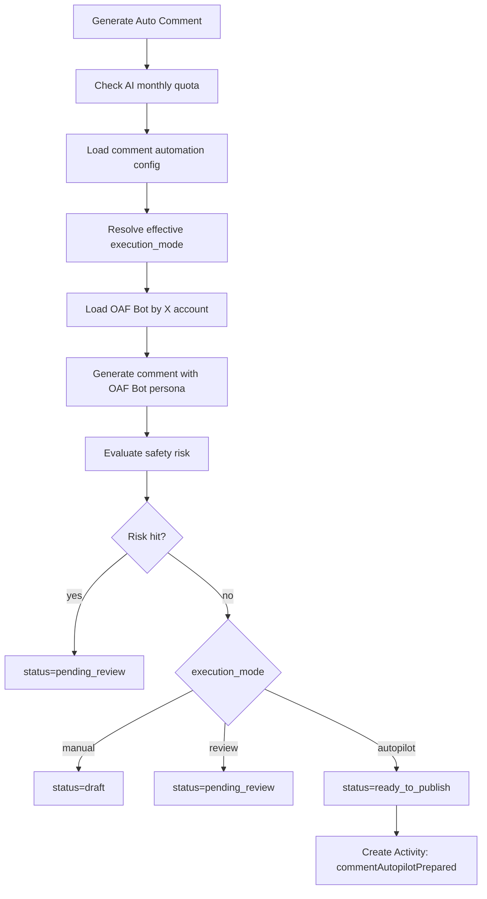

# OAF Bot Execution Mode 技术设计

## 目标

在不破坏当前 OAF Bot、Auto Comment、Billing 和 AI 生成计量的前提下，为自动化链路增加执行模式基础能力。

本阶段只完成配置和状态流转，不接入真实 X 评论发布。

## 数据结构

### automation_configs

新增字段：

| 字段 | 类型 | 说明 |
| --- | --- | --- |
| `execution_mode` | string | `manual` / `review` / `autopilot`，默认 `review` |

当前复用 `automation_configs` 承载四类自动化的执行模式，后续可拆到 `oaf_bot_execution_policies`：

```text
user_id + type -> execution_mode
```

其中 `type=comment` 对应 Auto Comment。

OAF Bot 绑定规则保持 one bot per account：

- 一个 OAF Bot 只有一个 `twitter_account_id`。
- 一个 `twitter_account_id` 同一时间只能绑定一个 active OAF Bot。
- 自动化生成时按 `twitter_account_id` 查询绑定 Bot，不通过 Bot 反查多个账号。
- 多账号复用人设未来通过 Bot Template / Clone 实现，本阶段不新增多账号绑定关系表。

### auto_comment_tasks

扩展状态语义：

| 状态 | 含义 |
| --- | --- |
| `draft` | 手动模式下的建议草稿 |
| `pending_review` | 审核队列 |
| `approved` | 人工批准 |
| `ready_to_publish` | 全托管模式通过基础风控，等待未来真实发布器接管 |
| `rejected` | 人工拒绝 |
| `blocked` | 安全拦截 |
| `failed` | 生成或执行失败 |
| `sent` | 未来真实发布成功 |

## 后端接口

新增：

```http
PATCH /api/v1/automations/:type/execution-mode
```

请求：

```json
{
  "execution_mode": "review"
}
```

规则：

- `type` 必须是 `post` / `reply` / `comment` / `dm`
- `execution_mode` 必须是 `manual` / `review` / `autopilot`
- 设置 `autopilot` 时校验当前用户套餐必须是 Plus / Pro / Pro+
- 不设置时兼容旧配置，默认按 `review` 返回

## Auto Comment 生成流程



## 风控规则

当前为基础规则：

- 自动化配置 `blocked_keywords`
- OAF Bot `forbidden_topics`
- 高风险词：
  - guaranteed return / guaranteed profit / risk-free
  - seed phrase / private key / connect wallet
  - 稳赚 / 保本 / 收益保证 / 私钥 / 助记词 / 连接钱包 / 官方客服

命中风险后统一降级到 `pending_review`。

## 前端改动

### Auto Comment 页面

新增执行模式选择卡：

- 手动模式
- 审核后发布
- 全托管

前端通过 `billing/subscription` 判断套餐是否可选择全托管：

- Plus / Pro / Pro+：可选
- Free Trial / Basic：显示锁定和升级提示

保存执行模式调用：

```ts
automationService.updateExecutionMode("comment", mode)
```

### Automations 编辑弹窗

增加通用执行模式字段，覆盖所有自动化类型的配置编辑入口。

## 兼容性

- 老用户没有 `execution_mode` 时，后端返回 `review`。
- Auto Comment 已有 `review` 状态仍可批准，新增 `pending_review` 不破坏旧记录。
- 当前不会调用真实 X 评论发布接口。
- AI 生成次数、OAF Bot 最近生成记录、Billing 使用量沿用现有 `scene=auto_comment` 记录。

## 验收要点

- 未登录接口仍返回 401。
- review 模式生成 `pending_review`。
- autopilot 模式生成 `ready_to_publish`。
- 风险命中时 autopilot 降级 `pending_review`。
- 全托管不会真实发到 X。
- Plus 以下无法设置 autopilot。
