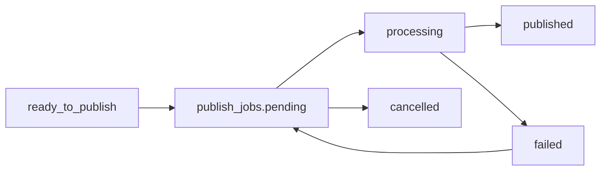

# Publishing Pipeline 技术设计 V2

## 目标

建立统一发布任务模型 `publish_jobs`，由 `PublishingService` 统一处理 `comment` / `reply` 的待发布内容。V2 新增真实 X Publisher Adapter 接口层，但 scheduler 默认仍使用 simulated publish，不会自动真实发布到 X。

## 数据模型

`publish_jobs`

- `id`
- `user_id`
- `twitter_account_id`
- `bot_id`
- `source_type`: `post` / `comment` / `reply` / `dm`
- `source_id`
- `content`
- `status`: `pending` / `processing` / `published` / `failed` / `cancelled`
- `execution_mode`
- `publish_mode`: `simulated` / `dry_run` / `real`
- `attempt_count`
- `max_attempts`
- `next_attempt_at`
- `last_error`
- `external_id`
- `external_url`
- `raw_response`
- `published_at`
- `created_at`
- `updated_at`

唯一约束：`source_type + source_id`，确保同一草稿只生成一个发布任务。

## 状态机



## 服务边界

- Auto Comment / Auto Reply 只负责生成内容和进入 `ready_to_publish`。
- PublishingService 负责创建、扫描、声明、处理、重试和取消发布任务。
- XPublisher 是真实 X API adapter 接口，只允许 PublishingService 调用。
- API scheduler 只执行 simulated publish；真实发布必须走手动 `publish-now` 接口。
- API scheduler 启动 Publishing Pipeline；admin-api 不启动。

## 并发保护

发布器每轮扫描最多 20 条 due pending job。处理前通过条件更新：

`WHERE id = ? AND status = 'pending' AND attempt_count < max_attempts`

只有更新成功的 worker 可以处理该 job，避免重复发布。

## V1 发布逻辑

模拟发布成功条件：

- 用户订阅有效。
- X 账号仍为 connected。
- source 仍属于当前用户。
- 内容非空。
- source 状态仍允许发布。

失败时记录 `last_error`，同步 source 状态为 `failed`，写 Activity。

成功时记录 `published_at`，同步 source 状态为 `published`，写 Activity。

## API

- `GET /api/v1/publishing/jobs`
- `GET /api/v1/publishing/status`
- `POST /api/v1/publishing/jobs/:id/retry`
- `POST /api/v1/publishing/jobs/:id/cancel`
- `POST /api/v1/publishing/jobs/:id/publish-now`

所有接口必须认证，并限制只能访问当前用户数据。

## X Publisher Adapter

真实 adapter 接口：

```go
type XPublisher interface {
    PublishReply(ctx context.Context, account model.TwitterAccount, targetTweetID string, content string) (PublishResult, error)
    PublishComment(ctx context.Context, account model.TwitterAccount, targetTweetID string, content string) (PublishResult, error)
}
```

`reply` 和 `comment` 当前都映射到 X API v2 reply tweet 能力，但业务层保留两种语义，便于后续分别扩展风控、文案和额度。

## 手动真实发布开关

配置：

```yaml
x_publisher:
  real_publish_enabled: false
  manual_publish_enabled: true
  per_account_daily_limit: 20
  per_account_min_interval_seconds: 300
  dry_run: true
```

语义：

- `real_publish_enabled=false` 且 `dry_run=false`：任何真实发布请求直接返回 `publisher_real_publish_disabled`。
- `manual_publish_enabled=true`：前端可以展示人工触发入口。
- `dry_run=true`：通过发布前校验后只记录 dry-run 成功，不调用 X。
- `per_account_daily_limit`：单个 X 账号每日手动真实发布或 dry-run 次数上限。
- `per_account_min_interval_seconds`：单个 X 账号两次手动发布之间的最小间隔。

## 手动 publish-now 流程

1. 校验 job 属于当前用户。
2. 校验 job 状态为 `pending` 或 `failed`，source 状态为 `ready_to_publish` 或 `failed`。
3. 校验 `manual_publish_enabled`，并在 `dry_run=false` 时校验 `real_publish_enabled`。
4. 校验用户订阅有效。
5. 校验 X 账号 connected、access token 存在、OAuth scopes 包含 `tweet.write`。
6. 校验 source_type 仅支持 `comment` / `reply`。
7. 校验每日限流和冷却时间。
8. `dry_run=true` 时写入 `publish_mode=dry_run` 并标记 published，但不调用 X。
9. `dry_run=false` 时调用 XPublisher，成功后写入 `external_id` / `external_url`。
10. 失败时写入 `last_error`，同步 source 为 `failed`，并记录 Activity。

## 灰度状态接口

`GET /api/v1/publishing/status`

返回：

- `real_publish_enabled`
- `manual_publish_enabled`
- `dry_run`
- `per_account_daily_limit`
- `per_account_min_interval_seconds`
- `current_user_connected_accounts_count`
- `accounts_missing_tweet_write_count`

该接口必须登录，不返回 access token 或 refresh token。

## 后续真实 X API 开启步骤

1. 在 X Developer Portal 确认应用拥有 `tweet.write` 且用户重新授权后 token scopes 包含 `tweet.write`。
2. 在测试环境私有配置中设置：

```yaml
x_publisher:
  real_publish_enabled: true
  manual_publish_enabled: true
  dry_run: true
```

3. 先保留 `dry_run=true` 验证限流、权限校验、Activity 和 UI。
4. 确认无误后再把 `dry_run=false`，只开放人工点击发布。
5. scheduler 不应自动真实发布；如果未来要开启全托管真实发布，需要新增独立开关和更严格的风控。

真实 adapter 只在 PublishingService 内调用，不允许自动化模块绕过统一发布器。
