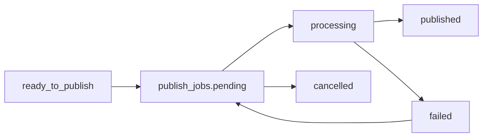

# Publishing Pipeline 技术设计 V1

## 目标

建立统一发布任务模型 `publish_jobs`，由 `PublishingService` 统一处理 `comment` / `reply` 的待发布内容。V1 使用 simulated publisher，不接入真实 X API。

## 数据模型

`publish_jobs`

- `id`
- `user_id`
- `twitter_account_id`
- `bot_id`
- `source_type`: `post` / `comment` / `reply` / `dm`
- `source_id`
- `content`
- `status`: `pending` / `processing` / `published` / `failed` / `cancelled`
- `execution_mode`
- `attempt_count`
- `max_attempts`
- `next_attempt_at`
- `last_error`
- `published_at`
- `created_at`
- `updated_at`

唯一约束：`source_type + source_id`，确保同一草稿只生成一个发布任务。

## 状态机

## 服务边界

- Auto Comment / Auto Reply 只负责生成内容和进入 `ready_to_publish`。
- PublishingService 负责创建、扫描、声明、处理、重试和取消发布任务。
- XPublisher 是预留 adapter 接口。V1 使用 simulated publisher。
- API scheduler 启动 Publishing Pipeline；admin-api 不启动。

## 并发保护

发布器每轮扫描最多 20 条 due pending job。处理前通过条件更新：

`WHERE id = ? AND status = 'pending' AND attempt_count < max_attempts`

只有更新成功的 worker 可以处理该 job，避免重复发布。

## V1 发布逻辑

模拟发布成功条件：

- 用户订阅有效。
- X 账号仍为 connected。
- source 仍属于当前用户。
- 内容非空。
- source 状态仍允许发布。

失败时记录 `last_error`，同步 source 状态为 `failed`，写 Activity。

成功时记录 `published_at`，同步 source 状态为 `published`，写 Activity。

## API

- `GET /api/v1/publishing/jobs`
- `POST /api/v1/publishing/jobs/:id/retry`
- `POST /api/v1/publishing/jobs/:id/cancel`

所有接口必须认证，并限制只能访问当前用户数据。

## 后续真实 X API 接入

将 simulated publisher 替换为真实 adapter：

- `PublishComment(ctx, job)`
- `PublishReply(ctx, job)`
- `PublishPost(ctx, job)`
- `PublishDM(ctx, job)`

真实 adapter 只在 PublishingService 内调用，不允许自动化模块绕过统一发布器。
